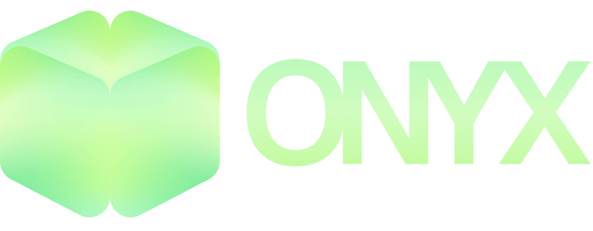

# OnyxAI - MultiversX Blockchain AI Assistant

<div align="center">
  

  <p align="center">
    
    
    
    
    
  </p>
  
  <p align="center">
    
    
    
  </p>
</div>

OnyxAI is a cutting-edge AI-powered assistant developed specifically for the MultiversX blockchain ecosystem. It enables users to analyze blockchain data, examine smart contracts, and monitor network statistics through an intuitive interface powered by advanced natural language processing.

## 🎯 Overview

OnyxAI serves as your intelligent companion in the MultiversX ecosystem, providing real-time insights, analytics, and smart contract analysis. Whether you're a developer, analyst, or blockchain enthusiast, our platform offers the tools you need to make informed decisions.

## 🚀 Features

### Core Capabilities
- **Natural Language Processing**
  - Ask questions about MultiversX in plain English
  - Get detailed explanations of complex blockchain concepts
  - Real-time query processing using advanced AI models

- **Smart Contract Intelligence**
  - Automated code analysis and security auditing
  - Gas optimization recommendations
  - Contract interaction simulations
  - Vulnerability detection and best practices

- **Real-time Analytics**
  - Live blockchain metrics and network statistics
  - Token analytics and price tracking
  - Transaction volume analysis
  - Network health monitoring
  - Historical data comparison

### User Experience
- **Modern Interface**
  - Smooth animations powered by Framer Motion
  - Intuitive chat-based interaction
  - Dark mode optimized design
  - Real-time updates and notifications

- **Responsive Design**
  - Seamless experience across all devices
  - Mobile-first approach
  - Adaptive layouts and components
  - Touch-friendly interface

## 🛠️ Technology Stack

### Frontend
- **Framework**: Next.js 15.2.0
- **UI Library**: React 19
- **Styling**: 
  - TailwindCSS for utility-first styling
  - Custom design system
  - Responsive grid layouts
  - Dark mode support

### AI/ML Stack
- **Language Models**: LangChain integration
- **Vector Database**: 
  - Pinecone for efficient similarity search
  - ChromaDB for local development
- **Natural Language Processing**:
  - Custom trained models for blockchain context
  - Real-time processing pipeline

### Development Tools
- **Language**: TypeScript
- **Package Manager**: npm/yarn
- **Version Control**: Git
- **Code Quality**:
  - ESLint for code linting
  - Prettier for code formatting
  - TypeScript strict mode

## 📦 Installation & Setup

### Prerequisites
- Node.js 18.0 or higher
- npm or yarn
- Git

### Development Setup
1. Clone the repository:
```bash
git clone https://github.com/alperenbekci/onyxai.git
cd OnyxAI
```

2. Install dependencies:
```bash
npm install
# or
yarn install
```

3. Configure environment variables:
```bash
cp .env.example .env
```

4. Start the development server:
```bash
npm run dev
# or
yarn dev
```

5. Access the application at http://localhost:3000

### Production Deployment
1. Build the application:
```bash
npm run build
# or
yarn build
```

2. Start the production server:
```bash
npm start
# or
yarn start
```

## 🔧 Configuration

### Environment Variables
Create a `.env` file in the root directory with the following variables:

```env
# Required
PINECONE_API_KEY=your_pinecone_api_key
OPENAI_API_KEY=your_langchain_api_key


### API Configuration
The application exposes several REST endpoints:

- `GET /api/chat`
  - AI assistant communication
  - Supports streaming responses
  - Rate limited to 100 requests/minute

- `GET /api/analytics`
  - Blockchain analytics data
  - Real-time metrics
  - Historical data aggregation

- `GET /api/contracts`
  - Smart contract analysis
  - Security scanning
  - Gas optimization suggestions

## 🔍 Project Structure

```
OnyxAI/
├── src/
│   ├── app/
│   │   ├── page.tsx          # Main page component
│   │   ├── layout.tsx        # Root layout
│   │   └── globals.css       # Global styles
│   ├── components/
│   │   ├── Chat.tsx         # Chat interface
│   │   ├── Navbar.tsx       # Navigation
│   │   └── Footer.tsx       # Footer component
│   └── utils/               # Utility functions
├── public/                  # Static assets
├── tests/                   # Test suites
└── config/                  # Configuration files
```

## 🤝 Contributing

We welcome contributions from the community! Here's how you can help:

1. Fork the repository
2. Create your feature branch:
```bash
git checkout -b feature/amazing-feature
```
3. Commit your changes:
```bash
git commit -m 'feat: Add amazing feature'
```
4. Push to the branch:
```bash
git push origin feature/amazing-feature
```
5. Open a Pull Request

### Development Guidelines
- Follow the existing code style
- Write meaningful commit messages
- Add tests for new features
- Update documentation as needed
- Ensure all tests pass before submitting PR

## 📚 Documentation

Detailed documentation is available in the `/docs` directory:
- API Reference
- Component Library
- Development Guide
- Deployment Instructions
- Security Best Practices

## 🔒 Security

- All API endpoints are rate-limited
- Authentication required for sensitive operations
- Regular security audits
- Vulnerability disclosure program

## 📄 License

This project is licensed under the MIT License - see the [LICENSE](LICENSE) file for details.

## 🙏 Acknowledgments

- MultiversX Ecosystem
- LangChain Community
- Open Source Contributors
- Early Access Users


